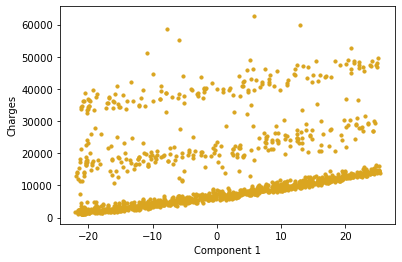

# Insurance-Charges-Prediction

## Description

- There are a lot of factors that affect someone's health insurance costs.
- Here I tried to predict a person's insurance costs based on age, sex, bmi, amount of children, whether or not they smoke, and where they live.
- I tested linear regression (with lasso, ridge, and elastic net regularizations) as well as random forest regression. 
- Principal component analysis (PCA) was used to reduce dimensionality for facilitated visualization.

## Code and Resources Used
**Python Version:** 3.9   
**Packages:** numpy, pandas, seaborn, sklearn  
**Data Source:** https://www.kaggle.com/datasets/mirichoi0218/insurance
